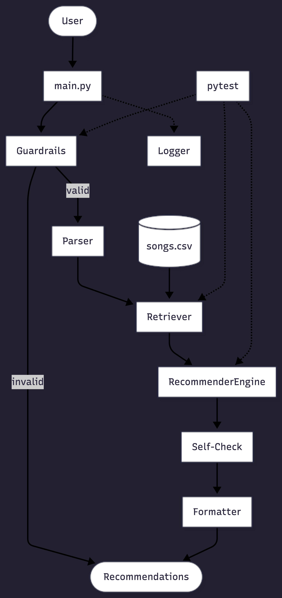
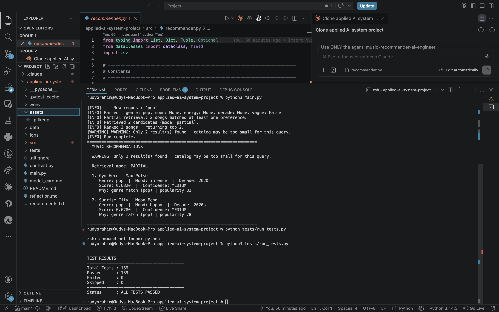
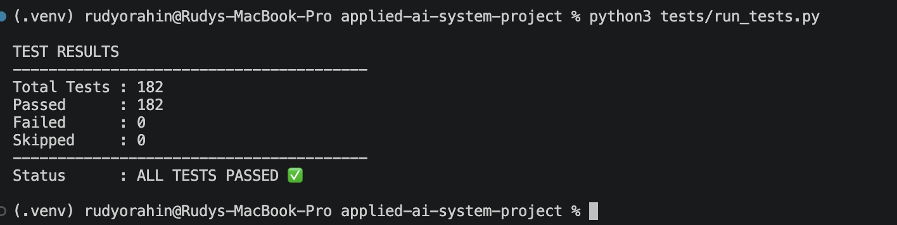
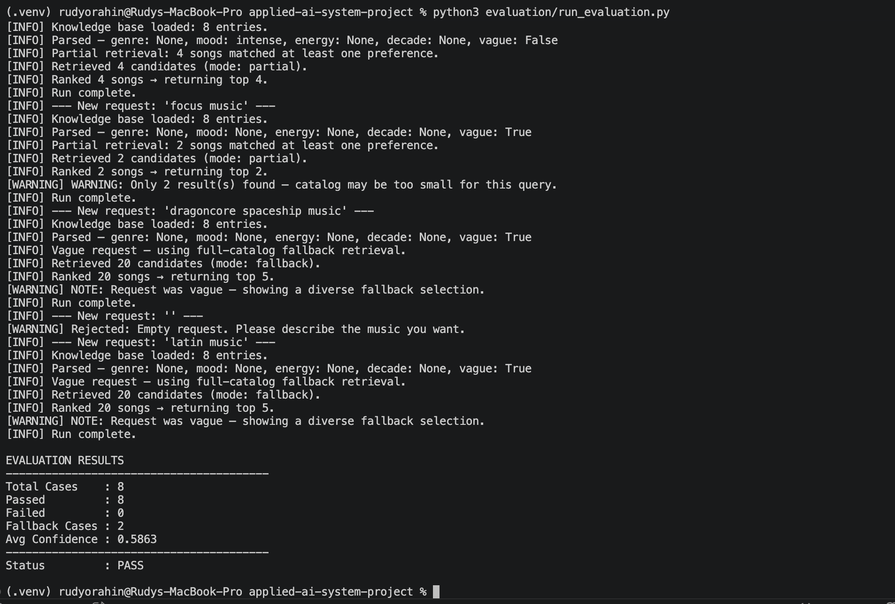
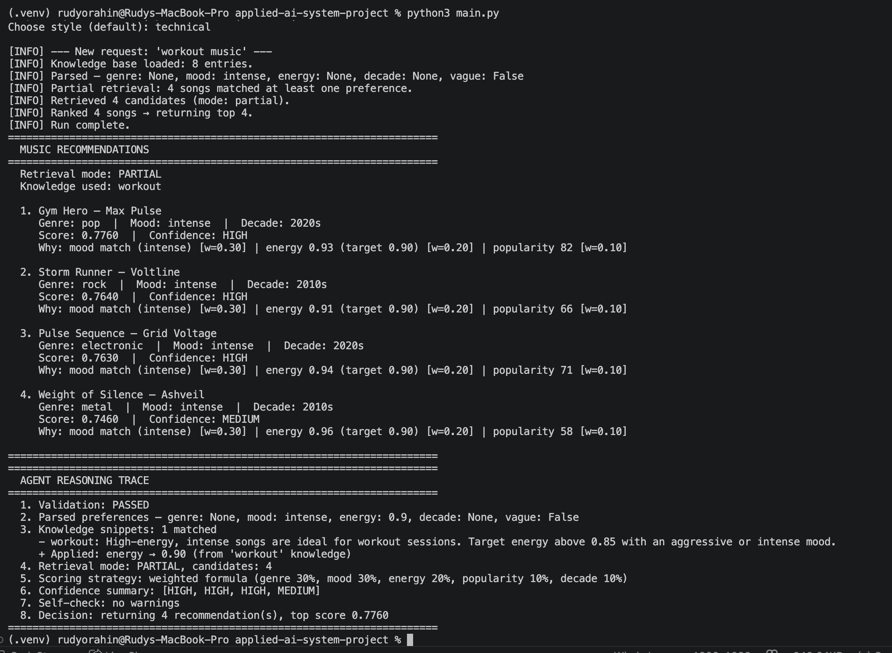
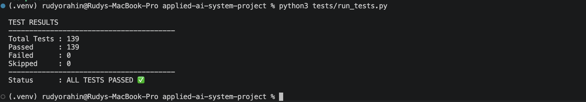

# Applied AI Music Recommendation System

## Project Summary

A content-based music recommendation system that accepts natural-language requests, parses them
into structured preference profiles, retrieves candidate songs from a local catalog, and returns
ranked recommendations with plain-language explanations.

The system demonstrates three applied AI techniques in a single, testable pipeline: RAG-style
retrieval, an agentic multi-step workflow, and a reliability layer with guardrails, structured
logging, and automated tests. Each recommendation includes a score, a confidence label, and a
"Why" explanation that makes the system's reasoning transparent rather than opaque.

Real-world music platforms like Spotify and YouTube use collaborative filtering and content-based
models at scale. This system focuses on the content-based side: matching song attributes to user
preferences using a transparent weighted formula — a scaled-down version of production logic that
is fully inspectable and testable.

---

## Original Project Reference

This project extends the **Music Recommender Simulation**, a baseline content-based recommender
that scored songs against a fixed user profile using nine acoustic features (genre, mood, energy,
acousticness, tempo, danceability, popularity, instrumentalness, and speechiness). The simulation
used a static `UserProfile` object and a single weighted-sum formula with five named scoring modes
(BALANCED, GENRE_FIRST, MOOD_FIRST, ENERGY_FOCUSED, DISCOVERY).

The Applied AI System replaces the static profile with natural-language parsing, adds RAG-style
retrieval, and wraps the pipeline in an agentic controller with self-checking and structured
output. The original simulation's 96 tests remain in `tests/test_recommender.py` and continue to
pass alongside the new test suite.

---

## Architecture Overview

The system runs a six-step pipeline on every request:

1. **Validate** — guardrails reject empty, whitespace-only, or too-short input before it reaches the pipeline
2. **Parse** — natural language is mapped to a structured `UserProfile` (genre, mood, energy, decade) using keyword tables
3. **Retrieve** — the catalog is pre-filtered using a three-tier RAG-style strategy (EXACT, PARTIAL, or FALLBACK) before scoring
4. **Score** — each candidate song is scored with a five-dimension weighted formula and assigned a confidence label
5. **Self-check** — the agent inspects its own output for quality issues (low confidence, too few results, fallback mode, missing genre or mood in top results)
6. **Format** — results are assembled into a structured, human-readable block with score, confidence, and a "Why" explanation per song



Full component reference and data flow details: [docs/architecture.md](docs/architecture.md)

---

## Setup Instructions

Requirements: Python 3.8+

```bash
# 1. Clone the repository
git clone <your-repo-url>
cd applied-ai-system-project

# 2. Create and activate a virtual environment
python3 -m venv .venv
source .venv/bin/activate       # Mac / Linux
# .venv\Scripts\activate        # Windows

# 3. Install dependencies
pip install -r requirements.txt

# 4. Run the interactive recommender
python3 main.py

# 5. Run all tests
pytest

# 6. Run the clean test summary
python3 tests/run_tests.py
```

Expected test result: **139 passed**

---

## Sample Interactions

All outputs below are real terminal output from `python3 main.py`.



---

### Input 1: Specific genre, mood, and energy

```text
What kind of music are you looking for? I want nostalgic rock with high energy
```

```text
======================================================================
  MUSIC RECOMMENDATIONS
======================================================================
  Retrieval mode: PARTIAL

  1. Storm Runner — Voltline
     Genre: rock  |  Mood: intense  |  Decade: 2010s
     Score: 0.6040  |  Confidence: MEDIUM
     Why: genre match (rock) | mood mismatch (intense ≠ moody) | energy 0.91 (target 0.85) | popularity 66

  2. Late Night Kings — Cipher Block
     Genre: hip-hop  |  Mood: moody  |  Decade: 2010s
     Score: 0.5960  |  Confidence: MEDIUM
     Why: genre mismatch (hip-hop ≠ rock) | mood match (moody) | energy 0.74 (target 0.85) | popularity 68

  3. Night Drive Loop — Neon Echo
     Genre: synthwave  |  Mood: moody  |  Decade: 2010s
     Score: 0.5870  |  Confidence: MEDIUM
     Why: genre mismatch (synthwave ≠ rock) | mood match (moody) | energy 0.75 (target 0.85) | popularity 57

======================================================================
```

PARTIAL retrieval mode activated because "nostalgic" maps to mood `moody` and "rock" maps to genre
`rock`, but the catalog has no song with both attributes. The parser extracted three signals from
one sentence (genre, mood, energy), and the scorer surfaced the closest matches with full
transparency on every mismatch.

---

### Input 2: Exact genre and mood match

```text
What kind of music are you looking for? give me chill lofi music from the 2010s
```

```text
======================================================================
  MUSIC RECOMMENDATIONS
======================================================================
  WARNING: Only 2 result(s) found — catalog may be too small for this query.

  Retrieval mode: EXACT

  1. Midnight Coding — LoRoom
     Genre: lofi  |  Mood: chill  |  Decade: 2010s
     Score: 0.8550  |  Confidence: HIGH
     Why: genre match (lofi) | mood match (chill) | popularity 55 | decade match (2010s)

  2. Library Rain — Paper Lanterns
     Genre: lofi  |  Mood: chill  |  Decade: 2010s
     Score: 0.8480  |  Confidence: HIGH
     Why: genre match (lofi) | mood match (chill) | popularity 48 | decade match (2010s)

======================================================================
```

EXACT retrieval mode activated because genre, mood, and decade were all specified and matched. Both
results received HIGH confidence. The self-check correctly flagged that only 2 results were
returned — a real signal that the 20-song catalog is the limiting factor, not the algorithm.

---

### Input 3: Unrecognized request (fallback)

```text
What kind of music are you looking for? I want dragoncore spaceship music
```

```text
======================================================================
  MUSIC RECOMMENDATIONS
======================================================================
  NOTE: Request was vague — showing a diverse fallback selection.

  Retrieval mode: FALLBACK

  1. Gym Hero — Max Pulse
     Genre: pop  |  Mood: intense  |  Decade: 2020s
     Score: 0.5320  |  Confidence: MEDIUM
     Why: popularity 82

  2. Sunrise City — Neon Echo
     Genre: pop  |  Mood: happy  |  Decade: 2020s
     Score: 0.5280  |  Confidence: MEDIUM
     Why: popularity 78

  3. Sugar & Smoke — Redd Velvet
     Genre: r&b  |  Mood: happy  |  Decade: 2020s
     Score: 0.5270  |  Confidence: MEDIUM
     Why: popularity 77

  4. Bassline Therapy — Flow State
     Genre: hip-hop  |  Mood: focused  |  Decade: 2010s
     Score: 0.5240  |  Confidence: MEDIUM
     Why: popularity 74

  5. Pulse Sequence — Grid Voltage
     Genre: electronic  |  Mood: intense  |  Decade: 2020s
     Score: 0.5210  |  Confidence: MEDIUM
     Why: popularity 71

======================================================================
```

The parser extracted nothing recognizable and marked the request as vague. The agent activated
FALLBACK mode and returned the full catalog ranked by popularity alone — all other preference
weights defaulted to their neutral 0.5 contribution. The self-check surfaced the vague status
explicitly rather than returning results silently.

---

## Design Decisions

### Content-based approach

Content-based filtering matches item attributes directly to a user's stated preferences without
requiring user history or behavior data. This was the appropriate choice for a system with a static
catalog and no feedback loop — it makes the scoring logic fully inspectable and deterministic.

### RAG-style retrieval

Scoring every song in the catalog on every request does not scale and can surface irrelevant
results when preferences are specific. Pre-filtering the catalog before scoring
(EXACT → PARTIAL → FALLBACK) reduces the candidate set to the most relevant songs first. This
mirrors how production retrieval-augmented systems work: retrieve a focused set, then rank within
it. The retrieval mode is surfaced to the user in every output so the reasoning path is visible.

### Agentic workflow

Wrapping the pipeline in `AppliedMusicAgent` rather than a single scoring function creates clear
separation between steps, makes each stage independently testable, and enables the self-check step
to inspect its own output before returning it. The agent can reason about result quality — low
confidence, fallback mode, small result set — and surface those signals explicitly rather than
returning results with no context.

### Trade-offs

- The catalog contains 20 songs. Retrieval mode and confidence labels are accurate, but result
  diversity is limited by catalog size, not by the algorithm.
- There is no ML model. The scoring formula is hand-tuned and static. It does not learn from user
  behavior or adapt across sessions.
- Genre and mood matching is binary (exact string comparison). Adjacent genres such as "rock" and
  "indie rock" receive zero partial credit, which can produce unexpected mismatches.
- The parser uses keyword tables. Phrasing not covered by the tables is silently ignored, which can
  cause under-parsing on complex or unusual requests.

---

## Testing Summary

**Framework:** pytest

**Total tests:** 139 — 43 new functionality tests (`tests/test_functionality.py`) and 96 original
simulation tests (`tests/test_recommender.py`)

**Test categories (functionality suite):**

- `TestGuardrails` — validates that empty, whitespace-only, and malformed inputs are rejected
  before reaching the pipeline; also tests CSV row validation (bad energy value, bad popularity
  value, missing decade field)
- `TestScoring` — verifies that the weighted formula produces scores in [0.0, 1.0], that genre
  matches outrank mismatches, that results are sorted descending, and that confidence labels map
  correctly to score thresholds
- `TestDeduplication` — confirms that exact and case-insensitive duplicate songs are removed and
  that the first occurrence is always preserved
- `TestVagueBehavior` — checks that unrecognized requests are flagged as vague, that FALLBACK mode
  activates, and that results still return rather than crashing
- `TestExplanations` — asserts that every recommendation includes a non-empty explanation string
  and that genre and mood matches are named explicitly in the "Why" field
- `TestNormalRequest` — end-to-end output format checks: MUSIC RECOMMENDATIONS header, Score,
  Confidence, Why fields present, and correct return type
- `TestEmptyInput` — empty and whitespace-only strings return an error message without raising an
  exception
- `TestUnknownGenre` — unrecognized genres fall back gracefully without crashing

**Failures encountered:** None. All 139 tests passed on first full run after the pipeline was
complete.

**What the tests revealed:** The deduplication tests surfaced a design question early — should
deduplication happen at load time or query time? Keeping it in `load_songs()` is more efficient
and easier to test in isolation, so that became the decision. The self-check tests confirmed that
quality warnings (low confidence, fallback mode, small result set) are surfaced explicitly rather
than silently absorbed.

Run the clean summary:

```bash
python3 tests/run_tests.py
```

---

## Optional Stretch Features

Four optional features were implemented to extend the system beyond the baseline requirements.

---

### 1. RAG Enhancement

**New files:** `docs/music_knowledge_base.md`, `src/knowledge_retrieval.py`

The knowledge base is a structured markdown document containing 8 domain-knowledge entries
(workout, focus, party, sleep, nostalgic, road trip, meditation, morning). Each entry defines:

- trigger keywords
- suggested energy level, mood, and decade
- a plain-language note explaining the mapping

`knowledge_retrieval.py` loads the knowledge base at query time, matches entries against the
user request by keyword, and calls `apply_knowledge_hints()` to fill in preference dimensions
the keyword parser could not extract. Hints only apply to dimensions the parser left as `None` —
they never overwrite a parser result.

**Practical effect:**

- `"focus music"` — "focus" is not in the parser's keyword tables, so the profile would normally
  be vague and fall back to full-catalog ranking. The knowledge base adds `mood=focused` and
  `target_energy=0.45`, making the request non-vague and enabling partial retrieval.
- `"workout music"` — the parser already sets `mood=intense`, but the knowledge base adds
  `target_energy=0.90`, improving energy-dimension scoring for high-intensity songs.
- A `Knowledge used: <entry>` line appears in every output where knowledge was applied.

---

### 2. Agentic Workflow Enhancement

**Modified:** `src/agent.py`, `main.py`

`AppliedMusicAgent.run()` accepts an optional `show_steps=True` parameter. When enabled, a
structured **Agent Reasoning Trace** is appended to the output showing eight numbered steps:

1. Validation result
2. Parsed preferences (genre, mood, energy, decade, vague flag)
3. Knowledge snippets matched and hints applied
4. Retrieval mode and candidate count
5. Scoring strategy (weights per dimension)
6. Confidence summary across all results
7. Self-check warnings
8. Final decision (result count and top score)

This is an observable engineering trace — it shows what the agent actually did at each pipeline
step, not private chain-of-thought reasoning. `show_steps=False` (the default) leaves output
completely unchanged, so all existing tests pass without modification.

`main.py` prompts the user to enable steps and select a style before running.

---

### 3. Specialization Simulation

**New file:** `src/specialization.py`

Four output styles simulate how a specialized model might present the same underlying data with
a different tone. Style is applied only to the "Why" explanation line — scores, songs, and
confidence labels remain identical across all styles.

- `default` — original pipe-separated format, unchanged
- `professional` — semicolons as separators, formal phrasing
- `casual` — friendlier language ("genre fits", "vibe is a bit off")
- `technical` — adds weight annotations per dimension (`[w=0.30]`, `[w=0.20]`)

Invalid style values fall back to `default` without raising an error.

This is documented as fine-tuning/specialization simulation using constrained style templates —
the same technique used to simulate persona-specific output without training a separate model.

---

### 4. Evaluation Harness

**New files:** `evaluation/eval_cases.json`, `evaluation/run_evaluation.py`

`eval_cases.json` defines 8 predefined test inputs covering the expected behavior range:

- `nostalgic rock with high energy` — partial retrieval
- `calm music from the 2010s` — partial retrieval
- `popular energetic pop` — partial retrieval
- `workout music` — partial retrieval (knowledge augments energy)
- `focus music` — partial retrieval (knowledge sets mood=focused)
- `dragoncore spaceship music` — fallback (unrecognized)
- `""` (empty input) — error
- `latin music` — fallback (unsupported genre)

Each case specifies: `should_error`, `expected_retrieval_mode`, `expected_keyword`,
`minimum_confidence`, and `expect_fallback`.

`run_evaluation.py` loads the cases, runs the agent on each input, checks all expectations,
and prints a summary:

```bash
python3 evaluation/run_evaluation.py
```

Example output:

```text
EVALUATION RESULTS
----------------------------------------
Total Cases    : 8
Passed         : 8
Failed         : 0
Fallback Cases : 2
Avg Confidence : 0.5863
----------------------------------------
Status         : PASS
```

---

### Stretch Feature Summary

- **RAG Enhancement** — `docs/music_knowledge_base.md` loads; "focus music" and "workout music"
  use partial retrieval (not fallback) due to knowledge augmentation
- **Agentic Workflow Enhancement** — `show_steps=True` appends an 8-step Agent Reasoning Trace;
  `show_steps=False` output is unchanged
- **Specialization Simulation** — `technical` output contains `[w=0.30]`; `professional` uses
  semicolons; `casual` uses friendlier language; scores are identical across all styles
- **Evaluation Harness** — `python3 evaluation/run_evaluation.py` reports 8/8 PASS

All 182 tests pass (139 original + 43 stretch feature tests).

**Test suite — 182/182 passed:**



**Evaluation harness — 8/8 cases passed:**



**Agent Reasoning Trace with technical style (workout music):**



---

## Reliability and Evaluation

This section documents how the system proves it works — through automated tests, transparent
scoring, input validation, structured logging, and a self-check step that inspects its own output
before returning it to the user.

---

### A. Automated Testing

**Framework:** pytest

**Total tests:** 139 — run with `pytest` or `python3 tests/run_tests.py`

The suite is split across two files:

- `tests/test_recommender.py` — 96 tests from the original simulation baseline; verify the core
  scoring formula, UserProfile construction, and all five scoring modes (BALANCED, GENRE_FIRST,
  MOOD_FIRST, ENERGY_FOCUSED, DISCOVERY)
- `tests/test_functionality.py` — 43 tests for the new Applied AI layer; cover:
  - **Input validation** — empty strings, whitespace-only input, and too-short requests are
    rejected before reaching the pipeline
  - **Scoring logic** — weighted formula produces scores in [0.0, 1.0]; genre match outranks
    genre mismatch; confidence labels map to the correct score thresholds
  - **Ranking correctness** — results are returned in descending score order; ties are broken
    consistently
  - **Explanations** — every recommendation includes a non-empty "Why" string; genre and mood
    matches are named explicitly
  - **Edge cases** — empty input, unknown genre, vague requests, and duplicate songs are all
    handled without raising an exception

All tests use an in-memory fixture (temporary CSV) so they are isolated from the real catalog and
pass deterministically regardless of catalog contents.

---

### B. Confidence Scoring

Every recommendation includes a numeric score and a human-readable confidence label:

| Label  | Score threshold | Meaning                                           |
|--------|-----------------|---------------------------------------------------|
| HIGH   | ≥ 0.75          | Strong match across most preference dimensions    |
| MEDIUM | ≥ 0.50          | Partial match — some dimensions aligned           |
| LOW    | < 0.50          | Weak match — few or no preference signals matched |

The score is computed by `score_song()` in [src/recommender_engine.py](src/recommender_engine.py)
using a five-dimension weighted formula (genre 30%, mood 30%, energy 20%, popularity 10%, decade
10%). Unspecified dimensions receive a neutral 0.5 contribution so they do not unfairly penalize
any song.

Confidence labels appear in every output line (`Confidence: HIGH / MEDIUM / LOW`) so users can
immediately see how well each result matched their request — not just a raw number. This makes the
system's uncertainty visible rather than hidden.

---

### C. Guardrails and Error Handling

Guardrails in [src/guardrails.py](src/guardrails.py) intercept bad input at two points:

- **Empty input** — `validate_request()` rejects empty strings and whitespace-only requests
  before they reach the pipeline, returning a clean `[Input Error]` message
- **Too-short input** — requests under 3 characters are rejected with an explanatory message
- **Invalid song data** — `validate_song()` checks each CSV row for missing required fields,
  out-of-range energy values (must be [0.0, 1.0]), and non-integer popularity values; bad rows
  are skipped at load time
- **Unknown genre / mood** — `check_genre_support()` and `check_mood_support()` normalize input
  against catalog vocabulary; unrecognized values are silently treated as unspecified rather than
  crashing the parser
- **Vague input** — when no genre, mood, energy, or decade is extracted from the request, the
  profile is marked `is_vague=True` and FALLBACK mode activates; results are returned ranked by
  popularity alone
- **Duplicate songs** — `deduplicate_songs()` removes songs with identical (title, artist) pairs
  at load time; the first occurrence is preserved and a warning is logged for each duplicate removed

None of these cases raise an exception. The system always returns a string.

---

### D. Logging

The logger in [src/logger.py](src/logger.py) writes to two destinations simultaneously:

| Destination     | Level | Format                                    | Purpose                              |
|-----------------|-------|-------------------------------------------|--------------------------------------|
| Console stdout  | INFO  | `[LEVEL] message`                         | Visible during interactive use       |
| `logs/app.log`  | DEBUG | `timestamp [LEVEL] message`               | Full trace for post-run debugging    |

Every pipeline stage emits a log entry: request received, parse result, retrieval mode and count,
ranking result, self-check flags, and run complete. The `logs/` directory is created automatically
on first run if it does not exist.

Log entries make it possible to reconstruct exactly what the system did on any given request —
which retrieval mode fired, how many candidates were scored, and which self-check flags were raised
— without re-running the request.

---

### E. Self-Check / Agent Evaluation

After ranking, `AppliedMusicAgent.self_check()` in [src/agent.py](src/agent.py) inspects its
own output and attaches warning or note flags before returning results to the user:

- **Fewer than 3 results** → `WARNING: Only N result(s) found — catalog may be too small`
- **All results have LOW confidence** → `WARNING: All results have LOW confidence`
- **Top score below 0.50** → `WARNING: Best match score is X.XX — no strong matches found`
- **FALLBACK + vague request** → `NOTE: Request was vague — showing a diverse fallback selection`
- **FALLBACK + specific request** → `NOTE: No catalog songs matched — showing fallback recommendations`
- **Preferred genre absent from top results** → `NOTE: Genre 'X' is not represented in top results`
- **Preferred mood absent from top results** → `NOTE: Mood 'X' is not represented in top results`

These flags appear at the top of every recommendation block. The system surfaces its own
uncertainty explicitly rather than returning results that look confident but are not.

---

### Test Results



### Reliability Summary

- 139 out of 139 tests passed
- The system handles empty, vague, and unknown inputs without crashing
- Confidence scores (HIGH / MEDIUM / LOW) provide transparency into recommendation quality
- Reliability improved after adding guardrails, deduplication, and self-check logic
- Logging to both console and `logs/app.log` makes every pipeline run fully traceable

---

## Reflection

Building this system made the gap between "a script that recommends songs" and "a system with
observable, testable reasoning" concrete. A simple script returns results. A system with
guardrails, structured logging, self-checking, and 139 automated tests makes it possible to trust
what the results mean and understand why they change when something in the pipeline shifts.

Explainability turned out to be a design constraint, not a feature added at the end. Because every
recommendation had to include a "Why" string, the scoring function had to track which sub-scores
fired and why — not just return a number. That requirement shaped the data model from the beginning
and made the system easier to debug and test than a black-box approach would have been.

Testing is what separates a working prototype from something you can reason about confidently. The
139 tests are not just a safety net — they are a specification. The test for "unknown genre uses
fallback" documents expected system behavior as clearly as any written spec would, and it will
catch regressions automatically if the retrieval logic changes. The original simulation's 96 tests
provided that foundation and made the new functionality suite faster to write because the scoring
logic was already verified.

The clearest difference between this and a simple script is that this system knows when it does
not know. When a request is vague, the agent says so. When confidence is low, it says so. When the
catalog is too small to satisfy a query, it says so. That kind of self-awareness is what makes
applied AI systems trustworthy in practice — and it only exists because the pipeline was designed
to expose it, and the tests were written to verify it.

---

## Reflection and Ethics

### 1. Limitations and Biases

**Small catalog size.**
The catalog contains 20 songs. Result diversity is capped by catalog size, not by the algorithm.
A query for "chill lofi from the 2010s" returns at most 2 results — not because the system
failed, but because only 2 such songs exist. This is surfaced explicitly via the self-check
warning, but it is still a real constraint.

**Content-based filtering has no memory.**
The system matches song attributes to stated preferences. It has no user history, no play counts,
and no cross-user signals. It cannot learn that a user dislikes a specific artist, or that their
mood preferences shift over time. Every request is treated as if it came from a new user.

**Binary genre and mood matching.**
Genre and mood matches are exact string comparisons. "Rock" and "indie rock" score identically to
a genre mismatch — there is no partial credit for adjacent categories. This can surface
unintuitive rankings when a user's preferred genre is close but not identical to catalog entries.

**Keyword parser coverage.**
The parser maps user language to structured preferences using fixed keyword tables. Phrasing not
in the tables is silently ignored. A request like "something to study to at midnight" may extract
nothing useful and fall through to FALLBACK mode even though the intent is clear to a human reader.

**Filter bubble and popularity bias.**
FALLBACK mode ranks entirely by popularity. Popular songs therefore appear in every fallback
result set regardless of user intent. Over repeated use, this would systematically over-expose
the same high-popularity songs to users with vague or unusual preferences.

**No real personalization.**
There is no feedback loop. The system cannot improve its recommendations based on what a user
accepted or skipped. Confidence scores reflect catalog fit, not actual user satisfaction.

---

### 2. Potential Misuse and Prevention

**Risks:**

- Confidence labels (HIGH / MEDIUM / LOW) could be read as objective quality judgments rather
  than what they are: a measure of how well a song's attributes matched the stated preferences.
  A LOW-confidence result is not a bad song — it is a song that did not fit the parsed profile.
- A biased catalog — one that overrepresents certain genres, decades, or popularity tiers —
  produces biased recommendations regardless of how well the scoring formula works. The algorithm
  cannot correct for gaps in the data it runs on.
- Popularity-weighted fallback could systematically disadvantage niche genres. Users who prefer
  less-popular styles receive lower-quality fallback results than users who prefer mainstream music.

**Mitigations already in place:**

- Every recommendation includes a "Why" explanation that names which dimensions matched and which
  did not. Users can see the reasoning rather than just the result.
- Confidence labels are always displayed and are defined by a transparent threshold (≥ 0.75 = HIGH,
  ≥ 0.50 = MEDIUM, < 0.50 = LOW), not hidden inside an opaque model.
- The retrieval mode (EXACT / PARTIAL / FALLBACK) is shown in every output so users know when
  they are seeing a best-effort result rather than a targeted one.
- Guardrails reject malformed input before it can produce misleading output.
- Logging creates a full audit trail of every pipeline decision.

**Further improvements that would reduce risk:**

- Expanding the catalog to reduce the influence of any single song or genre cluster.
- Adding diversity enforcement so that fallback results span multiple genres rather than
  defaulting to the same popular songs.
- Explaining confidence thresholds directly in the output so users understand what the labels mean.

---

### 3. Reliability Surprises During Testing

**Vague inputs required more design than expected.**
Initially, requests that extracted no useful preferences simply returned low-scoring results with
no explanation. Adding explicit vague detection, FALLBACK mode, and the self-check NOTE flag
required revisiting the agent's control flow — it was not a one-line fix.

**Catalog size became a reliability signal.**
The self-check warning for fewer than 3 results was added specifically because test runs on
specific queries kept returning 1–2 results that looked like failures but were actually correct
behavior given the catalog. The warning turned a confusing output into an informative one.

**Scoring weights dominated rankings more than expected.**
Because genre and mood together account for 60% of the score, a song with a genre match and
mood mismatch consistently outranked songs with no genre match but better energy and decade fits.
This is correct by design, but it made some test cases unintuitive to reason about before the
weight distribution was internalized.

**Guardrails and self-check improved result trustworthiness significantly.**
Before adding `validate_request()` and `self_check()`, the system returned results silently for
every input — empty strings, single characters, and nonsense requests all produced output that
looked legitimate. Guardrails and self-check are what make the difference between a system that
produces output and a system that produces trustworthy output.

**Automated tests caught edge cases that manual testing missed.**
The deduplication tests, in particular, surfaced a design question (load-time vs. query-time
deduplication) that would have been easy to overlook. Writing tests for expected behavior on
edge cases made the behavior explicit and the decision auditable.

---

### 4. AI Collaboration

**Helpful suggestion — agentic pipeline structure.**
AI helped identify the multi-step agentic pattern early: validate input, parse request, retrieve
candidates, score and rank, self-check output, format results. Structuring the system this way
created clean separation between steps, made each stage independently testable, and enabled the
self-check step to inspect its own output before returning it. Without that structure, the system
would likely have been a single scoring function with no visibility into pipeline state.

**Flawed suggestion — architecture diagram.**
AI initially generated an architecture diagram that was too complex for a project screenshot. It
included low-level implementation details, multiple nested boxes, and component labels that
reflected internal class names rather than user-facing pipeline steps. The diagram was accurate
but unreadable at the size it would appear in a README. It had to be redrawn as a simpler
high-level flow that matched what someone reading the project for the first time actually needs
to understand.
