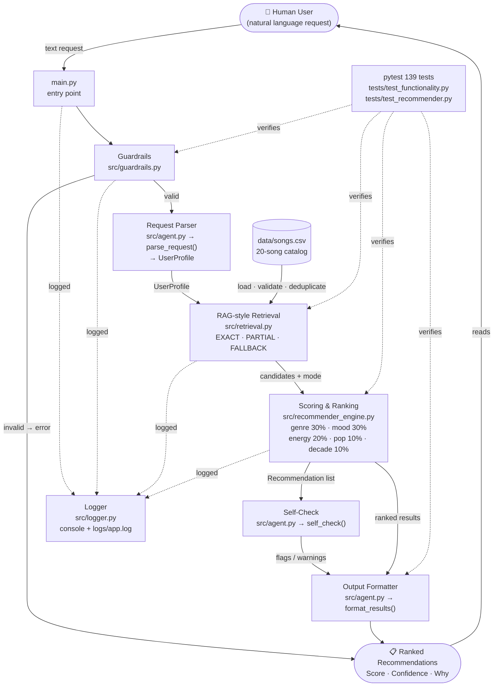
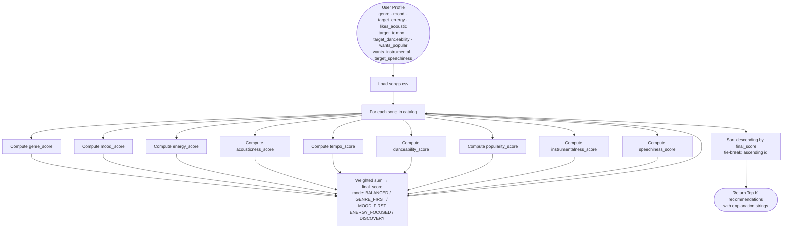

# Applied AI Music Recommendation System

## Project Summary

An explainable applied AI music recommender that demonstrates three advanced AI features:
retrieval-style pre-filtering, an agentic multi-step workflow, and a reliability layer with
guardrails, logging, and automated testing.

The system accepts a natural-language music preference (e.g. *"I want nostalgic rock with high
energy"*), parses it into a structured profile, retrieves candidate songs from a local catalog,
scores and ranks them with a transparent weighted formula, and explains every recommendation.

---

## Quick Start (Applied AI System)

### Setup

```bash
python -m venv .venv
source .venv/bin/activate   # Mac / Linux
# .venv\Scripts\activate    # Windows

pip install -r requirements.txt
```

### Run the interactive recommender

```bash
python main.py
```

Example prompt: `I want nostalgic rock with high energy`

### Run all tests

```bash
pytest
```

Expected: **139 passed**

---

## How the Applied AI System Works

### Pipeline (6 steps)

```text
User request
    │
    ▼
1. Validate input (guardrails)
    │
    ▼
2. Parse natural language → UserProfile
    │
    ▼
3. RAG-style retrieval: exact / partial / fallback
    │
    ▼
4. Weighted scoring + explanations
    │
    ▼
5. Self-check (confidence, warnings, flags)
    │
    ▼
6. Formatted output with scores and Why: explanations
```

### Retrieval modes

| Mode | When used |
|------|-----------|
| `EXACT` | Genre AND mood both specified and matched |
| `PARTIAL` | At least one of genre, mood, or decade matched |
| `FALLBACK` | Nothing matched, or request was vague |

### Scoring weights

| Dimension  | Weight |
|------------|--------|
| Genre      | 30 %   |
| Mood       | 30 %   |
| Energy     | 20 %   |
| Popularity | 10 %   |
| Decade     | 10 %   |

Unspecified dimensions receive a neutral 0.5 contribution so they do not unfairly penalise any
song.

### Confidence labels

| Score | Label |
|-------|-------|
| ≥ 0.75 | HIGH |
| ≥ 0.50 | MEDIUM |
| < 0.50 | LOW |

### Key files

| File | Purpose |
|------|---------|
| `main.py` | Interactive entry point |
| `src/agent.py` | Agentic controller (6-step pipeline) |
| `src/retrieval.py` | RAG-style retrieval + CSV loader |
| `src/recommender_engine.py` | Weighted scoring and ranking |
| `src/guardrails.py` | Input validation and deduplication |
| `src/logger.py` | Console + file logging (`logs/app.log`) |
| `src/song.py` | Song dataclass |
| `src/user_profile.py` | UserProfile dataclass |
| `data/songs.csv` | 20-song catalog |
| `tests/test_functionality.py` | 43 functionality tests |

---

## System Design and Architecture

Full architecture details, component reference, and export instructions are in
[docs/architecture.md](docs/architecture.md).



> To export this diagram as a PNG, see [docs/architecture.md — Exporting to PNG](docs/architecture.md#exporting-to-png).

---

## Original Music Recommender Simulation

The original simulation project (9-feature weighted scoring, 5 scoring modes) is preserved in
`src/recommender.py` and `src/main.py`. Run it with:

```bash
python -m src.main
```

Its 96 tests remain in `tests/test_recommender.py` and continue to pass alongside the new tests.

---

---

## How The System Works

Real-world recommendation engines like Spotify and YouTube analyze millions of listening behaviors — plays, skips, replays, and saves — to continuously refine a model of what each listener enjoys. At scale, these systems blend collaborative filtering (finding patterns across users with similar taste) with content-based filtering (matching item attributes directly to a user's stated preferences). The result is a feedback loop that updates in real time.

This simulator focuses on the content-based side of that equation. It takes a snapshot of a user's musical preferences — preferred genre, mood, energy level, and acoustic texture — and scores every song in the catalog against that profile using a transparent weighted formula. Each recommendation comes with an explanation of exactly which attributes matched, making the system's reasoning visible rather than opaque.

### Song and UserProfile Features

- **genre** — the primary musical category (e.g., pop, hip-hop, classical); a genre mismatch heavily penalizes a song's score
- **mood** — the emotional tone (e.g., focused, relaxed, intense); differentiates a study track from a workout track even within the same genre
- **energy** — a 0–1 intensity scale; scored by closeness to the user's target, not binary match
- **acousticness** — a 0–1 texture scale measuring organic vs. electronic sound; inverted for users who prefer digital production

### Algorithm Recipe

1. Load songs from `data/songs.csv`.
2. Accept a `UserProfile` specifying: `favorite_genre`, `favorite_mood`, `target_energy` (float 0–1), `likes_acoustic` (bool).
3. For each song, compute nine sub-scores:
   - **genre_score**: 1.0 if genre matches, 0.0 otherwise
   - **mood_score**: 1.0 if mood matches, 0.0 otherwise
   - **energy_score**: `1.0 - abs(song.energy - user.target_energy)`
   - **acousticness_score**: `song.acousticness` if `likes_acoustic=True`, else `1.0 - song.acousticness`
   - **tempo_score**: `1.0 - abs(normalized_bpm - user.target_tempo)` (BPM normalized to [0, 1])
   - **danceability_score**: `1.0 - abs(song.danceability - user.target_danceability)`
   - **popularity_score**: `song.popularity / 100.0` (inverted if user prefers niche tracks)
   - **instrumentalness_score**: `song.instrumentalness` if `wants_instrumental=True`, else `1.0 - song.instrumentalness`
   - **speechiness_score**: `1.0 - abs(song.speechiness - user.target_speechiness)`
4. Combine into a final weighted score using the default **BALANCED** mode:

   `final_score = (0.35 × genre_score) + (0.25 × mood_score) + (0.15 × energy_score) + (0.08 × acousticness_score) + (0.07 × tempo_score) + (0.04 × danceability_score) + (0.02 × popularity_score) + (0.02 × instrumentalness_score) + (0.02 × speechiness_score)`

   Five named scoring modes are available: **BALANCED** (default), **GENRE_FIRST**, **MOOD_FIRST**, **ENERGY_FOCUSED**, and **DISCOVERY**. The active mode is set with one variable in `src/main.py`. Each mode redistributes weight across the same nine features.

5. Sort all songs descending by `final_score`. Ties broken by ascending song id.
6. Return the top K songs, each with an explanation string naming which sub-scores fired.

### Pipeline



---

## Getting Started

### Setup

1. Create a virtual environment (optional but recommended):

   ```bash
   python -m venv .venv
   source .venv/bin/activate      # Mac or Linux
   .venv\Scripts\activate         # Windows

2. Install dependencies

```bash
pip install -r requirements.txt
```

3. Run the app:

```bash
python -m src.main
```

### Running Tests

Run the starter tests with:

```bash
pytest
```

You can add more tests in `tests/test_recommender.py`.

---

## Experiments You Tried

Use this section to document the experiments you ran. For example:

- What happened when you changed the weight on genre from 2.0 to 0.5
- What happened when you added tempo or valence to the score
- How did your system behave for different types of users

---

## Limitations and Risks

- **Genre overfitting**: genre carries 35% of the total score in BALANCED mode (up to 55% in GENRE_FIRST mode). Songs outside the user's preferred genre rarely surface in top results, regardless of how well other features match.
- **Filter bubble**: the scoring formula rewards similarity to stated preferences with no mechanism to surface unfamiliar genres or moods. The DISCOVERY mode partially mitigates this by boosting danceability and popularity weight at the expense of genre and mood.
- **Binary categorical matching**: genre and mood use exact string comparison — no partial credit. A "hip-hop" user receives zero genre points for an "r&b" song even if those genres are adjacent.
- **Cold start**: a user with no stated genre or mood preference loses 60% of available scoring weight (0.35 + 0.25) immediately in BALANCED mode, degrading recommendations to energy and lower-weighted features only.
- **Catalog size**: the system operates on 20 songs. Results are not generalizable to real-world scale, and any genre not present in the catalog can never score a genre match.
- **No temporal adaptation**: the user profile is static per run. The system cannot learn from behavior, adjust to context (time of day, activity), or update preferences over time.

You will go deeper on this in your model card.

---

## Reflection

Read and complete `model_card.md`:

[**Model Card**](model_card.md)

Write 1 to 2 paragraphs here about what you learned:

- about how recommenders turn data into predictions
- about where bias or unfairness could show up in systems like this


---

## 7. `model_card_template.md`

Combines reflection and model card framing from the Module 3 guidance. :contentReference[oaicite:2]{index=2}  

```markdown
# 🎧 Model Card - Music Recommender Simulation

## 1. Model Name

Give your recommender a name, for example:

> VibeFinder 1.0

---

## 2. Intended Use

- What is this system trying to do
- Who is it for

Example:

> This model suggests 3 to 5 songs from a small catalog based on a user's preferred genre, mood, and energy level. It is for classroom exploration only, not for real users.

---

## 3. How It Works (Short Explanation)

Describe your scoring logic in plain language.

- What features of each song does it consider
- What information about the user does it use
- How does it turn those into a number

Try to avoid code in this section, treat it like an explanation to a non programmer.

---

## 4. Data

Describe your dataset.

- How many songs are in `data/songs.csv`
- Did you add or remove any songs
- What kinds of genres or moods are represented
- Whose taste does this data mostly reflect

---

## 5. Strengths

Where does your recommender work well

You can think about:
- Situations where the top results "felt right"
- Particular user profiles it served well
- Simplicity or transparency benefits

---

## 6. Limitations and Bias

Where does your recommender struggle

Some prompts:
- Does it ignore some genres or moods
- Does it treat all users as if they have the same taste shape
- Is it biased toward high energy or one genre by default
- How could this be unfair if used in a real product

---

## 7. Evaluation

How did you check your system

Examples:
- You tried multiple user profiles and wrote down whether the results matched your expectations
- You compared your simulation to what a real app like Spotify or YouTube tends to recommend
- You wrote tests for your scoring logic

You do not need a numeric metric, but if you used one, explain what it measures.

---

## 8. Future Work

If you had more time, how would you improve this recommender

Examples:

- Add support for multiple users and "group vibe" recommendations
- Balance diversity of songs instead of always picking the closest match
- Use more features, like tempo ranges or lyric themes

---

## 9. Personal Reflection

A few sentences about what you learned:

- What surprised you about how your system behaved
- How did building this change how you think about real music recommenders
- Where do you think human judgment still matters, even if the model seems "smart"

