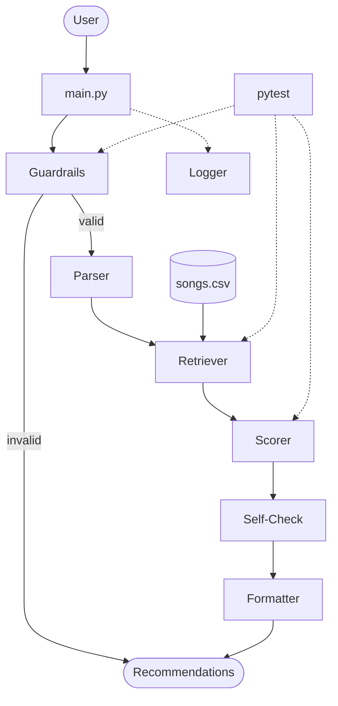

# System Design and Architecture

## Overview

The Applied AI Music Recommendation System is organized as a six-step agentic pipeline.
A user submits a natural-language request; the system validates it, parses it into a structured
profile, retrieves candidate songs from a local catalog, scores them with a transparent weighted
formula, self-checks its own output quality, and returns ranked recommendations with plain-language
explanations.

Three advanced AI features run inside the main pipeline — not as standalone scripts:

- **RAG-style retrieval** — the catalog is pre-filtered before scoring (exact / partial / fallback),
  so retrieved data directly shapes what gets recommended.
- **Agentic workflow** — `AppliedMusicAgent` orchestrates all six steps and self-checks its own
  confidence and result quality before returning output.
- **Reliability layer** — guardrails, dual logging, and 139 automated tests verify every layer
  of the system deterministically.

---

## Architecture Diagram

The source file for this diagram is [`assets/system_architecture.mmd`](../assets/system_architecture.mmd).



> To export as a PNG, see [Exporting to PNG](#exporting-to-png) below.
> Save the exported file as `assets/system_architecture.png`.

---

## Component Reference

**Entry point** — `main.py`
Accepts user input and calls `AppliedMusicAgent.run()`.

**Guardrails** — `src/guardrails.py`
Rejects empty or invalid input; validates CSV rows; removes duplicate songs.

**Parser** — `src/agent.py`
Maps natural language to `UserProfile` via genre, mood, energy, and decade keyword tables; sets the `is_vague` flag.

**Retriever** — `src/retrieval.py`
Pre-filters `songs.csv` using a 3-tier strategy: exact (genre + mood), partial (any one dimension), or fallback (full catalog).

**songs.csv** — `data/songs.csv`
20-song catalog with genre, mood, energy, popularity, and decade fields.

**Scorer** — `src/recommender_engine.py`
Computes a weighted score per song (genre 30%, mood 30%, energy 20%, popularity 10%, decade 10%); assigns a confidence label; generates an explanation string.

**Self-Check** — `src/agent.py`
Inspects result quality; flags low confidence, fewer than 3 results, fallback mode, and missing genre or mood in top results.

**Formatter** — `src/agent.py`
Assembles the final human-readable block: title, artist, score, confidence, and a Why explanation per song.

**Logger** — `src/logger.py`
Dual handler: console (INFO+) and `logs/app.log` (DEBUG+).

**pytest** — `tests/`
139 tests covering guardrails, retrieval, scoring, deduplication, vague requests, explanations, and end-to-end behavior.

---

## Data Flow

```text
User input (natural language)
        |
        v
  Guardrails -----> [invalid] --> Recommendations (error message)
        |
        | [valid]
        v
     Parser  -->  UserProfile
        |         (genre, mood, energy, decade, is_vague)
        v
    Retriever <-- songs.csv
        |         (exact / partial / fallback)
        v
     Scorer
        |         (weighted score, confidence, explanation)
        v
   Self-Check
        |         (quality flags and warnings)
        v
    Formatter
        |
        v
  Recommendations (ranked, explained)
```

Side channels active throughout:

- **Logger** receives a log event at every step
- **pytest** verifies Guardrails, Retriever, and Scorer independently and end-to-end

---

## Testing and Human Review

**Automated testing** (`pytest`) covers all layers:

- `TestGuardrails` — bad input rejected before reaching the pipeline
- `TestScoring` — weighted formula, confidence labels, sort order
- `TestDeduplication` — duplicate songs removed before scoring
- `TestVagueBehavior` — fallback mode activates for unrecognized requests
- `TestExplanations` — every recommendation includes a human-readable reason
- `TestNormalRequest` — end-to-end output format for valid requests
- `TestEmptyInput` — empty and whitespace-only inputs handled safely
- `TestUnknownGenre` — unrecognized genres fall back gracefully

Run the clean test summary:

```bash
python tests/run_tests.py
```

**Human review** happens at two points:

1. The user reads the formatted output — confidence labels and `Why:` explanations make the
   system's reasoning visible rather than opaque.
2. Developers review `logs/app.log` to trace retrieval mode, candidate count, and any warnings
   during testing or debugging.

---

## Exporting to PNG

The `.mmd` source is at `assets/system_architecture.mmd`. To export manually:

1. Open [https://mermaid.live](https://mermaid.live) in your browser.
2. Paste the contents of `assets/system_architecture.mmd` into the editor on the left.
3. Click **Export → PNG** in the top-right toolbar.
4. Save the file as:

```text
assets/system_architecture.png
```
